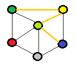
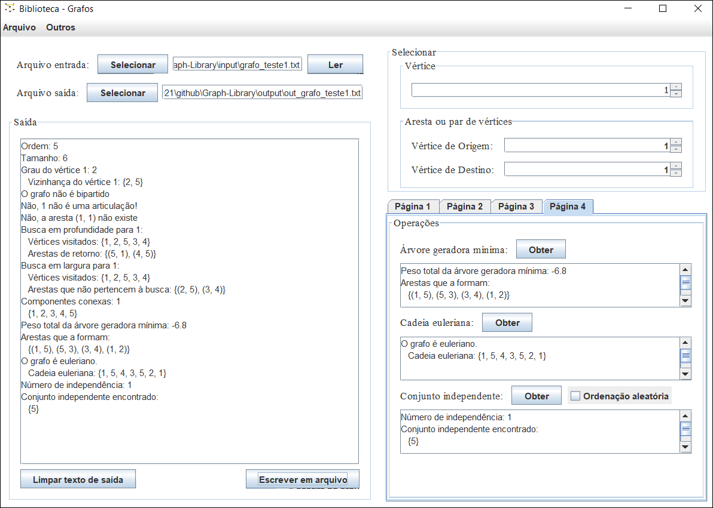
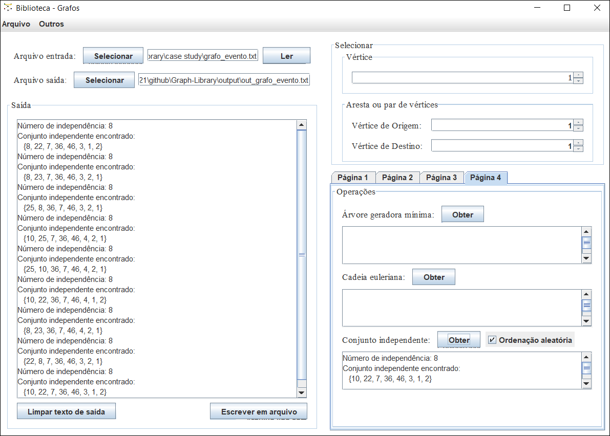

# Graph Library



A graph library developed in 2018 that implements some useful functions from Graph Theory for weighted undirected graphs. This application was proposed in a college assignment of the subject Graph Theory and Model. The description (portuguese only) of this assignment can be found [here](description-trabalho12018.pdf).

**Requirements:**
- Java 8 or newer versions

# Input File Format

An input file has the following format:
- The first line is the number of nodes of the graph;
- The following lines describe the edges: **source_id destination_id weight**
    - Example where source = first node, destination = third node, weight for the edge = 5.23: **1 3 5.23**

Some input files that can be used can be found in the [input folder](input/).

# Compiling and Executing

Execute the following command to **compile**:
```
javac -encoding UTF8 -cp . src/bibliotecagrafos/visao/*.java src/bibliotecagrafos/*.java -d build
```

Execute the following command to **execute**:
```
java -cp "build;." bibliotecagrafos.BibliotecaGrafos
```

Execution example:


# Case Study - Campus Party 2019 - Maximize the amount of activities / events to attend

This assignment proposed a case study using this library. The case study consisted to find the [Maximal Independent Set](https://en.wikipedia.org/wiki/Maximal_independent_set) for the [Campus Party Brasil 2019 agenda](case%20study/evento.xlsx "case study agenda"). The portuguese version can be found [here](case%20study "case study").

## Modeling

This event consisted of 52 activities with 152 time conflicts between pairs of events. To build a graph to work with these data, the following was adopted:
- **Nodes**: the event activities
- **Edges**: the time conflicts between two nodes

## Solving the problem

By executing a greedy heuristic a few times (random ordering implemented), the [result](case%20study/resultados_grafo_evento.txt "case study results") shows that one person could participate in up to 8 different activities in this event.

A presented solution is: **{8, 22, 7, 36, 46, 3, 1, 2}**.



Copyright © 2021 Daniel Freitas Martins (dnlfm) and Naira Cristiane dos Reis Diniz (NaiaraDiniz)
